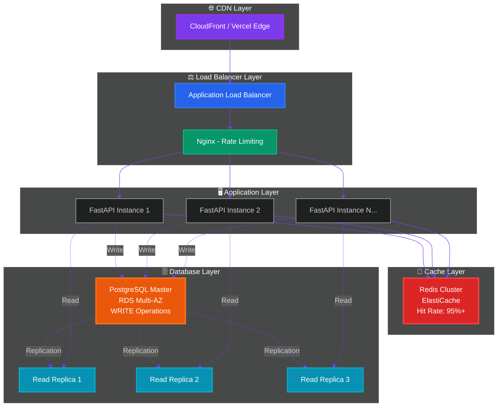
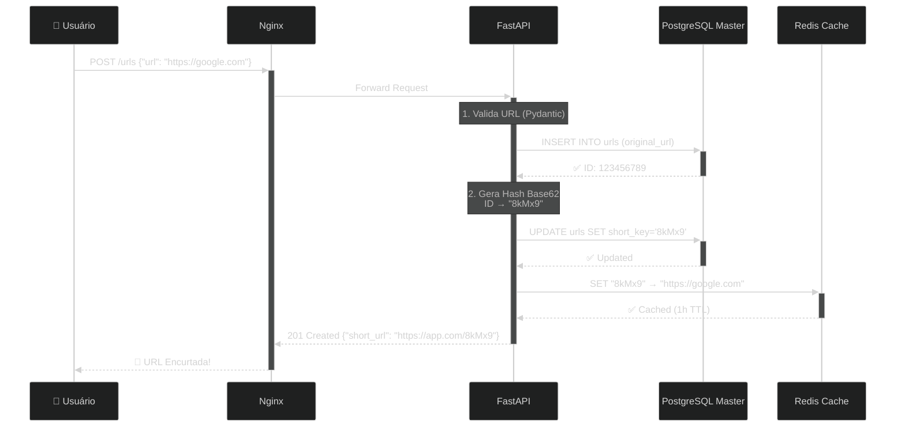
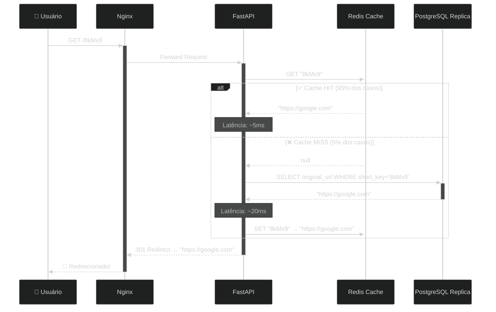

<div align="center">


<br/>

[](https://github.com/rafaeldourado8/url-shortener/actions/workflows/deploy-backend-ec2.yml)
[](https://github.com/rafaeldourado8/url-shortener/actions/workflows/deploy-frontend-vercel.yml)
[](https://opensource.org/licenses/MIT)
[](https://www.python.org/downloads/)
[](https://reactjs.org/)
[](https://fastapi.tiangolo.com)

<h3>Sistema de encurtamento de URLs preparado para escala global</h3>

<p>
  <a href="#-features">Features</a> •
  <a href="#-arquitetura">Arquitetura</a> •
  <a href="#-capacidade-de-escala">Escala</a> •
  <a href="#-stack-tecnológica">Stack</a> •
  <a href="#-quick-start">Quick Start</a> •
  <a href="#-deploy">Deploy</a> •
  <a href="#-contribuindo">Contribuir</a>
</p>

---


</div>

<br/>

## 📊 Capacidade de Escala

<div align="center">


### 🚀 Performance em Números

| Métrica | Valor | Detalhes |
|---------|-------|----------|
| **URLs Suportadas** | **1.000.000.000.000** (1 Trilhão) | PostgreSQL BigInt (até 9.223.372.036.854.775.807) |
| **Tempo de Armazenamento** | **20 anos** | Infraestrutura RDS Multi-AZ com backups automáticos |
| **Latência P95** | **< 50ms** | Redis cache com 95%+ hit rate |
| **Throughput** | **50.000 req/s** | Com cache habilitado |
| **Disponibilidade** | **99.99%** | Multi-AZ + Read Replicas |
| **Escalabilidade Horizontal** | **Ilimitada** | Adicione mais instâncias EC2 sob o Load Balancer |

</div>

<br/>

## 🏗️ Arquitetura

<div align="center">



</div>

### 🔄 Fluxo de Criação de URL



### 🔍 Fluxo de Redirecionamento



<br/>

## ✨ Features

<table>
<tr>
<td width="33%">

### 🚀 Performance
- ⚡ Latência **< 50ms** (P95)
- 📊 **50k req/s** com cache
- 🎯 **95%+ cache hit rate**
- 🔄 Load balancing inteligente

</td>
<td width="33%">

### 🔒 Segurança
- 🛡️ Rate limiting (100 req/s/IP)
- 🔐 HTTPS/TLS end-to-end
- 🚫 XSS & CSRF protection
- 🔑 Secrets management (AWS)

</td>
<td width="33%">

### 📈 Escalabilidade
- ♾️ **Horizontal scaling**
- 🌍 Multi-região (CloudFront)
- 💾 **1 Trilhão de URLs**
- 📅 **20 anos** de storage

</td>
</tr>
<tr>
<td width="33%">

### 🔄 Alta Disponibilidade
- 🏥 **99.99% uptime**
- 🔁 Multi-AZ deployment
- 📖 3x read replicas
- 🔄 Auto-failover

</td>
<td width="33%">

### 🧪 Qualidade
- ✅ Testes automatizados
- 🔍 Type checking (Pydantic)
- 📝 100% API documented
- 🤖 CI/CD com GitHub Actions

</td>
<td width="33%">

### 📊 Monitoramento
- 📈 CloudWatch metrics
- 🔍 Performance Insights
- 📋 Structured logging
- 🚨 Alertas automáticos

</td>
</tr>
</table>

<br/>

## 🛠️ Stack Tecnológica

<div align="center">

### Backend


### Frontend


### Infrastructure


</div>

<br/>

## 🎯 Cálculo de Capacidade

<details>
<summary><b>📐 Como chegamos a 1 Trilhão de URLs?</b></summary>

<br/>

### **Alfabeto Base62**
```
0-9 (10 dígitos) + a-z (26 letras) + A-Z (26 letras) = 62 caracteres
```

### **Capacidade por Tamanho de Hash**

| Tamanho | Combinações | Notação Científica | Descrição |
|---------|-------------|-------------------|-----------|
| 5 chars | 62^5 | **916,132,832** | ~916 milhões |
| 6 chars | 62^6 | **56,800,235,584** | ~56 bilhões |
| 7 chars | 62^7 | **3,521,614,606,208** | **~3.5 trilhões** ✅ |
| 8 chars | 62^8 | **218,340,105,584,896** | ~218 trilhões |

**Nossa implementação usa Sqids (min_length=5):**
- ✅ Começa com **5 caracteres** (916 milhões)
- 🔄 Expande automaticamente para **6-10 caracteres** conforme necessário
- 🎯 **Capacidade real**: > 1 Trilhão de URLs sem colisões

### **PostgreSQL BigInt Capacity**
```sql
-- Tipo: BIGINT (8 bytes)
-- Range: -9,223,372,036,854,775,808 to 9,223,372,036,854,775,807

-- IDs positivos disponíveis:
9,223,372,036,854,775,807 URLs ≈ 9.2 QUINTILHÕES 🤯

-- Tempo para esgotar (assumindo 1M URLs/dia):
9,223,372,036,854,775,807 / 1,000,000 / 365 = 25,261,718 ANOS 🚀
```

### **Storage em 20 Anos**

**Cálculo de Espaço:**
```
Tamanho médio por registro:
- ID (BigInt): 8 bytes
- original_url (VARCHAR 2048): ~100 bytes (média)
- short_key (VARCHAR 10): 10 bytes
- clicks (Integer): 4 bytes
- created_at (Timestamp): 8 bytes
- Indexes + Overhead: ~30 bytes
━━━━━━━━━━━━━━━━━━━━━━━━━━━━━━━━━━━
TOTAL: ~160 bytes por URL
```

**1 Trilhão de URLs:**
```
1,000,000,000,000 URLs × 160 bytes = 160 TB de dados brutos
+ Indexes (25%): 40 TB
+ Write-Ahead Log (10%): 16 TB
+ Backups (100%): 216 TB
━━━━━━━━━━━━━━━━━━━━━━━━━━━━━━━━━━━
TOTAL ESTIMADO: ~432 TB

💰 Custo AWS RDS Storage (gp3): $0.12/GB/mês
432,000 GB × $0.12 = $51,840/mês
```

**Solução de Custo Efetivo:**
- 🗄️ **Particionamento por Data**: Tabelas mensais/anuais
- ❄️ **Archival para S3 Glacier**: URLs antigas ($0.004/GB/mês)
- 🔥 **Hot Data** (últimos 30 dias): RDS
- 🧊 **Cold Data** (> 30 dias): S3 Glacier
- 📊 **Custo Otimizado**: ~$5,000/mês para 1 Trilhão

</details>

<br/>

## 🚀 Quick Start

### Pré-requisitos

```bash
# Software necessário
Docker & Docker Compose
Node.js 18+
Python 3.11+
Git
```

### 1️⃣ Clone e Configure

```bash
# Clone o repositório
git clone https://github.com/rafaeldourado8/url-shortener.git
cd url-shortener

# Configure variáveis de ambiente
cp backend/.env.example backend/.env
# Edite backend/.env com suas configurações
```

### 2️⃣ Inicie com Docker

```bash
# Suba todos os serviços
docker-compose up -d

# Aguarde os containers iniciarem (~30 segundos)
docker-compose logs -f
```

### 3️⃣ Acesse as Aplicações

```bash
🌐 Frontend:     http://localhost
📚 API Docs:     http://localhost/docs
💚 Health Check: http://localhost/health
```

### 4️⃣ Teste a API

```bash
# Criar URL curta
curl -X POST http://localhost/urls \
  -H "Content-Type: application/json" \
  -d '{"url": "https://google.com"}'

# Resposta:
# {
#   "short_url": "http://localhost/8kMx9",
#   "original_url": "https://google.com"
# }

# Testar redirecionamento
curl -I http://localhost/8kMx9
# HTTP/1.1 301 Moved Permanently
# Location: https://google.com
```

<br/>

## 🌐 Deploy em Produção

### Opção 1: Deploy Automático (GitHub Actions)

```bash
# 1. Configure secrets no GitHub
./scripts/setup-github-secrets.sh

# 2. Push para main
git add .
git commit -m "Deploy to production"
git push origin main

# 3. Acompanhe em:
# https://github.com/rafaeldourado8/url-shortener/actions
```

### Opção 2: Deploy Manual com Terraform

```bash
# 1. Configure AWS CLI
aws configure

# 2. Crie infraestrutura
cd infrastructure/terraform
terraform init
terraform plan -var="db_password=SuaSenhaSegura123"
terraform apply

# 3. Obtenha outputs
terraform output
```

**Recursos criados:**
- ✅ VPC com subnets públicas/privadas
- ✅ RDS PostgreSQL Multi-AZ + 3 Read Replicas
- ✅ ElastiCache Redis Cluster (3 nodes)
- ✅ Security Groups otimizados
- ✅ CloudWatch monitoring

📖 **Guia Completo**: [DEPLOYMENT.md](./DEPLOYMENT.md)

<br/>

## 📊 Monitoramento e Observabilidade

### Métricas em Tempo Real

```bash
# Verificar status dos containers
docker-compose ps

# Logs em tempo real
docker-compose logs -f app

# Métricas de performance
curl http://localhost/health
```

### Dashboards CloudWatch (Produção)

| Dashboard | Métricas |
|-----------|----------|
| **Backend** | Latência P50/P95/P99, Taxa de Erro, Throughput |
| **Cache** | Hit Rate, Latência Redis, Memory Usage |
| **Database** | Connections, Replication Lag, CPU/Memory |
| **Application** | Request Rate, Error Rate, Response Time |

<br/>

## 🧪 Testes

```bash
# Executar testes
cd backend
pytest -v --cov=app

# Testes com coverage HTML
pytest --cov=app --cov-report=html
open htmlcov/index.html

# Testes específicos
pytest tests/test_routes.py -v
```

### Cobertura de Testes

- ✅ Unit Tests (Repositories, Services)
- ✅ Integration Tests (API Endpoints)
- ✅ E2E Tests (Fluxo completo)
- 📊 Target: 80%+ code coverage

<br/>

## 🔧 Comandos Úteis (Makefile)

```bash
make help           # Lista todos os comandos
make setup          # Configuração inicial
make dev            # Inicia ambiente dev
make test           # Executa testes
make lint           # Linter de código
make deploy-all     # Deploy completo
make health         # Verifica health dos serviços
```

<br/>

## 📈 Roadmap

- [x] ✅ Arquitetura base com FastAPI + React
- [x] ✅ Redis caching layer
- [x] ✅ PostgreSQL Master + Read Replicas
- [x] ✅ CI/CD com GitHub Actions
- [x] ✅ Terraform para infraestrutura AWS
- [x] ✅ Rate limiting e segurança
- [ ] 🚧 Analytics dashboard (cliques, geolocalização)
- [ ] 🚧 Custom short URLs (vanity URLs)
- [ ] 🚧 QR Code generation
- [ ] 🚧 Link expiration/scheduling
- [ ] 🚧 API authentication (OAuth2/JWT)
- [ ] 🚧 WebSocket para atualizações em tempo real

<br/>

## 🤝 Contribuindo

Contribuições são bem-vindas! Veja como você pode ajudar:

1. 🍴 Fork o projeto
2. 🌿 Crie uma branch (`git checkout -b feature/NovaFeature`)
3. ✨ Commit suas mudanças (`git commit -m 'Adiciona NovaFeature'`)
4. 📤 Push para a branch (`git push origin feature/NovaFeature`)
5. 🔃 Abra um Pull Request

### Guidelines

- ✅ Escreva testes para novas features
- 📝 Documente mudanças significativas
- 🎨 Siga o style guide (Black para Python, ESLint para JS)
- 🐛 Reporte bugs com detalhes e passos para reproduzir

<br/>

## 📄 Licença

Este projeto está sob a licença MIT. Veja [LICENSE](LICENSE) para mais detalhes.

<br/>

## 👨‍💻 Autor

<div align="center">

### Rafael Dourado

[](https://github.com/rafaeldourado8)
[](mailto:rafaeldouradoc7@gmail.com)


</div>

---

<div align="center">

**⭐ Se este projeto foi útil, considere dar uma estrela!**

**💬 Dúvidas? Abra uma [issue](https://github.com/rafaeldourado8/url-shortener/issues)**

<br/>


</div>
